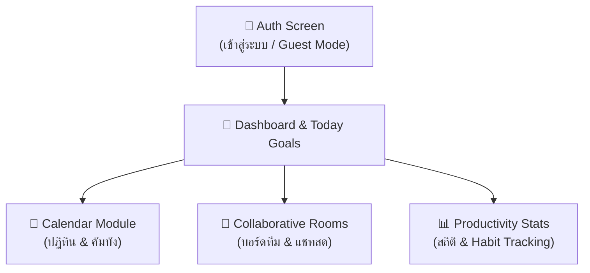

# 🏯 DoneDay — Japanese-Minimal Productivity & TodoList System

> **DoneDay** คือระบบจัดการภารกิจและเพิ่มผลผลิตสไตล์ **Japanese-Minimalism** ผสานความเรียบง่าย สบายตา และมีสมาธิ เข้ากับเครื่องมือบริหารจัดการงานระดับสูง (High Productivity System) เพื่อให้คุณและทีมทำงานได้อย่างมีประสิทธิภาพและบรรลุเป้าหมายในทุกๆ วัน


---

## 🌟 ฟีเจอร์หลัก (Key Features)

### 🎯 1. Today Goal & Zen Ambient (เป้าหมายรายวัน & สร้างสมาธิ)
- **Daily Progress Tracker:** ติดตามอัตราความสำเร็จ (%) และจำนวนวันทำงานต่อเนื่อง (Streak)
- **Zen Breathing Guide:** วงกลมนำการหายใจเข้า-ออก (Inhale / Hold / Exhale) ช่วยผ่อนคลายความเครียดก่อนเริ่มงาน
- **Native Lofi Player:** เครื่องเล่นเพลง Lofi Ambient ในตัว ปรับระดับเสียงได้ เพิ่มสมาธิขณะทำงาน

### 📅 2. Interactive Calendar & Time Block (ปฏิทินวางแผน)
- **Flexibility Views:** สลับมุมมองระหว่าง รายวัน, รายสัปดาห์ และ รายเดือน ได้อย่างอิสระ
- **Time Block Mapping:** วางแผนตารางชีวิตอย่างเป็นระบบ
- **Category Tagging:** จำแนกประเภทภารกิจ เช่น *Meditation, Code Audit, Design, Meeting*

### 👥 3. Collaborative Rooms & Kanban (ห้องทำงานกลุ่ม)
- **Drag & Drop Kanban:** ย้ายสถานะการ์ดงานผ่านคอลัมน์ `Define`, `Overview`, `In Audit`, `Approved` ด้วย `@dnd-kit`
- **Real-time Team Chat:** ระบบแชทสื่อสารประจำห้องทำงาน อัปเดตความคืบหน้ากับเพื่อนร่วมทีม
- **Member Management:** ระบบเชิญสมาชิกด้วยอีเมลหรือรหัสเข้าห้อง

### 📈 4. Advanced Analytics & Habits (สถิติและการติดตามนิสัย)
- **Visual Analytics:** แสดงกราฟสถิติงานที่ทำเสร็จย้อนหลังด้วย Recharts
- **Habit Progress:** ติดตามพฤติกรรมเชิงบวกส่วนบุคคล
- **Time Tracking:** คำนวณชั่วโมงโฟกัสงาน (Focus Hours) ย้อนหลัง

---

## 📐 โครงสร้างสถาปัตยกรรมหน้าจอ (Interface Architecture)



---

## 🛠️ เทคโนโลยีที่ใช้ (Tech Stack)

| หมวดหมู่ (Layer) | เทคโนโลยี (Technology) | รายละเอียด (Description) |
| :--- | :--- | :--- |
| **Core Framework** | **Next.js 14.2.3** (App Router) | โครงสร้าง React SSR/SSG พร้อมระบบ Routing ที่รวดเร็ว |
| **Language** | **TypeScript 5.4** / **React 18** | UI Component แบบ Type-Safe และ Reusable |
| **State Management** | **Zustand 4.5.2** | จัดการ State กลางของ Tasks, Rooms, Messages และ Auth |
| **Drag & Drop** | **@dnd-kit/core** / **sortable** | ระบบลากวางการ์ดภารกิจใน Kanban Board |
| **Styling & Theme** | **TailwindCSS 3.4** / **PostCSS** | ธีมมินิมอลญี่ปุ่น (Warm Cream `#FAF7F2` & Dark Charcoal `#2D2B2A`) |
| **Animations & Icons** | **Framer Motion** / **Lucide React** | เอฟเฟกต์การเปลี่ยนหน้า การสลับการ์ด และชุดไอคอน |
| **Data Visualization** | **Recharts 2.12** | กราฟสถิติ Productivity และเป้าหมาย |

---

## 📂 โครงสร้างโปรเจกต์ (Project Structure)

```text
TodoList/
├── src/
│   ├── app/                 # Next.js App Router (Layout & Page entry)
│   ├── components/
│   │   ├── auth/            # หน้าจอลงชื่อเข้าใช้งาน & Modal Login
│   │   ├── ui/              # Common UI Components (Button, Drawer, TaskCard, Modal)
│   │   ├── views/           # หน้าจอหลักของระบบ
│   │   │   ├── dashboard-view.tsx   # หน้าสรุปภาพรวม & กราฟสถิติ
│   │   │   ├── today-view.tsx       # เป้าหมายรายวัน + Zen Player
│   │   │   ├── rooms-view.tsx       # ห้องทำงาน Kanban & แชททีม
│   │   │   └── calendar-view.tsx    # ปฏิทินและจัดตารางเวลา
│   │   └── sidebar.tsx      # แถบนำทางด้านข้างแบบมินิมอล
│   ├── lib/                 # Shared Utilities & Translations (TH/EN)
│   ├── store/               # Zustand Global Store (useDoneDayStore.ts)
│   └── styles/              # Global Styles & Tailwind Config
├── done_day_2pages.html     # เอกสารสรุประบบ 2 แผ่น A4 (สำหรับสั่งพิมพ์/PDF)
├── package.json
└── tsconfig.json
```

---

## 🚀 วิธีการติดตั้งและรันโปรเจกต์ (Getting Started)

### 1. Clone Repository
```bash
git clone https://github.com/kunaaa123/TodoList.git
cd TodoList
```

### 2. ติดตั้ง Dependencies
```bash
npm install
```

### 3. รัน Development Server
```bash
npm run dev
```

เปิดเบราว์เซอร์แล้วเข้าไปที่ **[http://localhost:3000](http://localhost:3000)** (หรือพอร์ตที่ระบบระบุ)

---

## 📄 เอกสารสรุประบบสำหรับพิมพ์ (Printable Documentation)

ในโปรเจกต์นี้มีไฟล์สรุประบบความยาว **2 แผ่น A4** (`done_day_2pages.html`) ที่จัดสไตล์พร้อมพิมพ์ไว้ให้อยู่ใน Root Directory:
- สามารถเปิดไฟล์ [done_day_2pages.html](done_day_2pages.html) ในเบราว์เซอร์
- กด **`Ctrl + P`** สั่งพิมพ์ลงกระดาษ A4 หรือ บันทึกเป็น PDF ได้ทันที

---

## 📝 ลิขสิทธิ์และสิทธิ์การใช้งาน (License)

พัฒนาและดูแลโดยทีมงาน **DoneDay** — สงวนลิขสิทธิ์ตามใบอนุญาตโปรเจกต์แบบ Open Source
